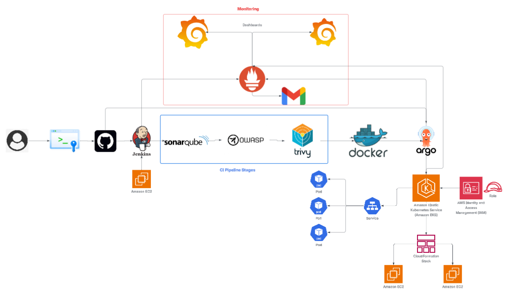

# End-to-end Zomato Clone Devops project

### Overview  
This project is a complete DevOps pipeline built around a production-style **Zomato Clone** application.  
It demonstrates real-world CI/CD automation, containerisation, GitOps deployment, and monitoring using modern DevOps tooling.

## Key Features  
- Fully automated **CI/CD pipeline using Jenkins**  
- **Containerised application** using Docker  
- **Static & security scanning** using SonarQube, OWASP Dependency-Check & Trivy  
- **Image-based deployments** into **Amazon EKS** using **Argo CD (GitOps)**  
- **AWS CloudFormation** for complete Infrastructure as Code  
- **Prometheus + Grafana** for metrics, dashboards & alerting  
- **Email alerting** via Gmail SMTP  
- Clean repo structure with production-style manifests

---

## Technologies & Tools  
| Layer                     | Tools / Platforms                                                
|---------------------------|------------------------------------------------------------------
| Version Control           | GitHub                                                          
| CI / Build                | Jenkins running on an AWS EC2 host   
| Static & Security Analysis| SonarQube, OWASP Dependency Check, Trivy 
| Containerisation          | Docker                            
| Container Registry        | Docker Hub / private registry                                  
| Deployment / GitOps       | Argo CD                            
| Orchestration             | Amazon EKS (Kubernetes)                                         
| Infrastructure as Code    | AWS CloudFormation & IAM                                        
| Monitoring & Logging      | Prometheus + Grafana, email alerts via Gmail/SMTP 

---

## Architecture  
Please refer to the diagram `architecture-diagram.PNG` in the root of the repository to visualise how components connect:  
- Developers commit code → triggers Jenkins pipeline  
- Pipeline runs code quality & security scans → builds Docker image → pushes to registry  
- Argo CD watches Git + registry → deploys to Amazon EKS cluster  
- Infrastructure (EC2, EKS, IAM roles) is created/managed via CloudFormation  
- Monitoring stack collects metrics from pods, nodes and CI tools → forwarded to Grafana dashboards and configured alerts.

---
License: 
This project is open-source and available under the **MIT License**.
